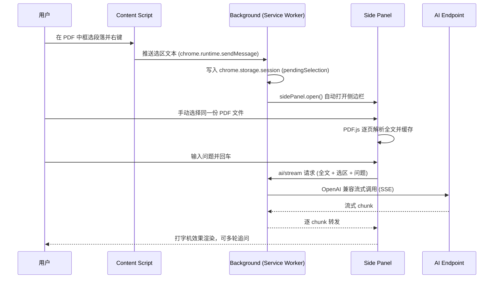

<div align="center">

# PDF AI Sidebar

**浏览器扩展：看 PDF 时框选一段，AI 结合整篇全文给你讲透 —— 多 Agent、多轮对话、流式输出**

[](https://github.com/JingHao-Leon/pdf-ai-sidebar)
[](https://github.com/JingHao-Leon/pdf-ai-sidebar/commits/main)
[](https://github.com/JingHao-Leon/pdf-ai-sidebar)
[](LICENSE)
[](https://github.com/JingHao-Leon/pdf-ai-sidebar)

**Manifest V3 · Side Panel 模式 · 当前版本 v0.4**

</div>

---

在网页端浏览 PDF 时框选任意段落，右键唤起 AI；AI 看到的不只是那几句话，而是**整篇 PDF 全文 + 选中段落**，在侧边栏里流式输出解释，同一引用下可连续追问。普通英文网页还支持「操作引导」模式：输入目标，AI 逐步高亮按钮带你操作。

## ✨ 亮点

<table>
<tr>
<td width="50%">

### 📄 基于整篇 PDF 解释
AI 的上下文是**全文**而非孤立的选中段——它能说明这段话在文档中的位置、作用，并关联其它章节。

</td>
<td width="50%">

### 💬 多 Agent · 多轮对话
右键菜单挂多个 AI agent 子菜单（预置 MiniMax / DeepSeek，OpenAI 兼容协议可扩展）；同一引用段落下连续追问，流式打字渲染。

</td>
</tr>
<tr>
<td width="50%">

### 🧭 网页 Guide 模式
在英文网页输入操作目标（如「如何在 GitHub 创建仓库」），AI 生成最多 8 步教程并逐步高亮元素，每一步由你点「下一步」确认——插件绝不自动提交密码、付款或删除数据。

</td>
<td width="50%">

### ⚡ 零构建 · 纯原生
无框架、无打包步骤，原生 ES Module + PDF.js，clone 下来直接「加载已解压的扩展程序」即可运行。快捷键 `Ctrl/Cmd+Shift+J` 一键发选区。

</td>
</tr>
</table>

## 🔄 工作原理



> **为什么全文要手动选一次文件**：Chrome PDF viewer 中 content script 进不去、background fetch `file://` 也被安全策略拦截。用户手动选文件（FileReader → PDF.js）是绕过限制后 100% 可靠的路径。

## 🚀 快速上手

1. 打开 `chrome://extensions`，右上角开启 **「开发者模式」**
2. 点 **「加载已解压的扩展程序」** → 选择本项目根目录
3. **重要**：在扩展卡片里打开 **「允许访问文件 URL」**（用于读本地 PDF）
4. 把扩展图标 📌 钉到工具栏
5. 点 ⚙ 进入选项页 → 选择 MiniMax 或 DeepSeek，填入你自己的 API Key

## 🧪 使用流程

```
1️⃣  打开 PDF（拖入 Chrome / Cmd+O / 地址栏 file://...pdf）
2️⃣  框选一行/一段
3️⃣  右键 → "AI 解释整篇" → 选择 Agent（如 DeepSeek）
4️⃣  右键菜单会自动打开 PDF AI 侧边栏
5️⃣  侧边栏里点 [📁 选择 PDF 文件]，选同一份
6️⃣  等全文加载（变绿点 ✓）
7️⃣  在底部输入框输问题 → 回车 → AI 基于整篇 PDF 流式回答
```

### 典型场景

- 阅读英文论文时选中关键段 → AI 翻译并解释
- 阅读法律合同选中某条 → AI 解释其在整篇合同里的作用
- 阅读技术文档选中一个术语 → AI 解释并关联文档其它章节

## 📁 项目结构

```
pdf-ai-sidebar/
├── manifest.json              # MV3 配置（side_panel + 快捷键 + 右键菜单）
├── icons/                     # 16/48/128 PNG 图标
├── src/
│   ├── sidepanel/             # ⭐ v0.4 主界面：Chrome Side Panel
│   │   ├── sidepanel.html
│   │   ├── sidepanel.css
│   │   └── sidepanel.js       # 选区显示 + PDF 上传 + 全文解析 + 多轮对话 + 网页 Guide
│   ├── content/
│   │   ├── content.js         # 监听右键，把选区推给 background
│   │   └── content.css
│   ├── background/
│   │   └── background.js      # 右键菜单 + storage + 流式 AI 调用转发
│   ├── options/               # 设置页（agent 配置 + 自定义 prompt）
│   ├── lib/
│   │   ├── ai-client.js       # 统一 AI 调用（OpenAI / Anthropic / Gemini 流式 SSE）
│   │   ├── prompt.js          # 全文 + 选区 prompt 拼装
│   │   └── pdf-parser.js      # PDF.js 解析封装
│   └── vendor/
│       └── pdfjs/             # PDF.js 4.0.379（本地打包，无外部依赖）
├── test-fixtures/             # Playwright E2E（mock DeepSeek）+ 测试 PDF
├── scripts/make_icons.py      # 图标生成脚本
└── README.md
```

## 🔧 配置

### 内置 Agent

| Agent | Endpoint | 默认 Model |
|---|---|---|
| MiniMax | `https://api.minimaxi.com/v1/chat/completions` | `MiniMax-M3` |
| DeepSeek | `https://api.deepseek.com/v1/chat/completions` | `deepseek-chat` |

API Key 由用户自行在选项页配置，不打包进扩展。底层客户端兼容 OpenAI / Anthropic / Gemini 三种流式协议，可自行扩展更多 agent。

### Prompt 模板

`{fullDoc}` = 整篇 PDF 全文，`{context}` = 选中段落，`{question}` = 你的问题。默认模板：

```
你是我的 PDF 阅读助手。我会给你一篇文档的全文（可能截断），以及我特别想理解的一段话。
请基于文档的整体内容，帮我解释选中这段话。回答时：
1. 简要说明这段话在文档中的位置和作用
2. 解释它的核心意思
3. 关联文档中其他相关段落（如果有）
4. 如果我附加了问题，优先回答问题

【文档全文】
"""{fullDoc}"""

【我选中的内容】
"""{context}"""

【我的问题】
{question}
```

## 🧪 E2E 测试

`test-fixtures/run_e2e.py` 提供完整链路测试（使用 mock DeepSeek，无需真实 Key）：启动 mock server → Playwright 以 `--load-extension` 启动 Chrome → 配置 mock key → 打开测试 PDF 框选 → 右键 → 验证侧边栏流式响应与多轮对话。

> 不同 Chrome 版本或本机扩展加载环境可能需要手动重新加载扩展后再运行。

## 🌐 浏览器兼容性

| 浏览器 | 支持情况 |
|---|---|
| Chrome 116+ | ✅ 完整支持 |
| Edge 116+ | ✅ 完整支持 |
| Firefox | ⚠️ Side Panel API 不兼容，暂不支持 |
| Safari | ❌ MV3 支持不完整 |

## ⚠️ 已知限制

1. **全文需要手动选一次文件**（原因见「工作原理」，同会话内会缓存不重复解析）
2. Side Panel 会占用浏览器右侧空间（但便于和 PDF 并排对照）
3. 少数加密/损坏的 PDF 解析会失败（PDF.js 在 service worker 环境的兼容问题）
4. AI 流式连接偶发断开时需要重试（自动重试机制尚未实现）
5. 排查错误的主入口：`chrome://extensions` 的 service worker console

## 🔒 隐私

- API Key 仅保存在 `chrome.storage.sync`（同步到你自己的浏览器账号）
- 选中段落和 PDF 全文只发往你自己选择的 AI endpoint
- 网页 Guide 模式仅在你主动生成教程时，将当前页面正文和可操作元素索引发送给你选择的 AI
- 不收集任何遥测数据

详见 [PRIVACY_POLICY.md](PRIVACY_POLICY.md)。

## 🔄 版本历史

| 版本 | 改动 |
|---|---|
| v0.1 | 初始版，side panel + 选中段（无全文） |
| v0.2 | side panel + 全文上下文（自动 fetch PDF 失败） |
| **v0.4** | **Side Panel 模式 + 手动选 PDF 文件**（当前） |

## 📝 License

[MIT](LICENSE)

---

<div align="center">
<sub>
如果这个项目对你有帮助，欢迎 Star ⭐ ｜ 问题反馈请开 <a href="https://github.com/JingHao-Leon/pdf-ai-sidebar/issues">Issue</a>
</sub>
</div>
